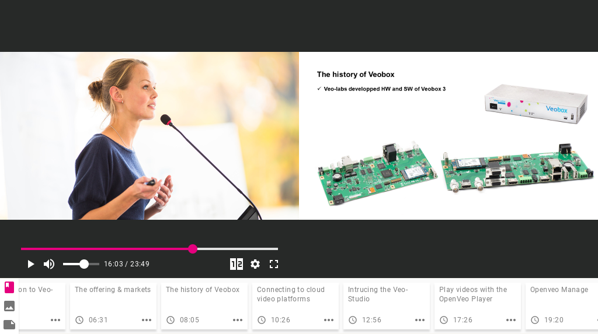

# Introduction

OpenVeo Player defines an AngularJS directive **opl-player**:

```html
<opl-player
  opl-data="data"
  opl-fullscreen-icon="true"
  opl-volume-icon="true"
  opl-template="split_50_50"
  opl-template-icon="true"
  opl-settings-icon="true"
  opl-veo-labs-icon="true"
  opl-time="true"
  opl-full-viewport="false"
  opl-language="en"
  opl-player-type="html"
  opl-auto-play="false"
  opl-remember-position="false"
  opl-chapters-tab="true"
  opl-tags-tab="true"
  opl-cuts="true"
></opl-player>
```

This directive creates a video player with images synchronization and chapters.



# Include player CSS

```html
<link rel="stylesheet" type="text/css" href="lib/openveo-player/dist/openveo-player.css">

<!-- Only for HTML type-->
<link rel="stylesheet" type="text/css" href="lib/video.js/dist/video-js.min.css">

```

# Include scripts

```html
<script type="text/javascript" src="lib/angular/angular.min.js"></script>
<script type="text/javascript" src="lib/angular-cookies/angular-cookies.min.js"></script>

<!-- Only for HTML type -->
<script type="text/javascript" src="lib/video.js/dist/video.min.js"></script>
<script type="text/javascript" src="lib/openveo-player/dist/openveo-player.min.js"></script>
```

**Nb :** **Video.js** library must be included before including the OpenVeo Player script.

# Attributes

**opl-player** directive attributes helps you customize the player.

## opl-data

Sets player data, points of interest and cuts.

```javascript
$scope.data = {
  mediaId: ['34532ezr54sdf87', 'dzzfeg4547841'], // The list of media ids, one id by source. For the "html" player, the first media id corresponds to the first source, the second media id to the second source and so on
  timecodes: [ // A list of indexes
    {
      timecode: 0, // The position of the index relative to the media duration (in milliseconds)
      image: { // The small and large version of the image representing the index
        small: 'https://host.local/image1-small.jpeg', // URL of the small image representing the index. Displayed in the list of indexes and when pointer is over the timebar. Expected small image size is 148x80
        large: 'https://host.local/image1-large.jpeg' // URL of the large image representing the index. Displayed in the area 2 when playing time corresponds to the index time, and when an index of the list of indexes is enlarged
      }
    },
    {
      timecode: 1200, // The position of the index relative to the media duration (in milliseconds)
      image: { // The small and large version of the image representing the index
        small: {
          url: 'https://host.local/sprite.jpeg', // URL of the sprite containing the small image representing the index. Displayed in the list of indexes and when pointer is over the timebar. Expected small image size is 148x80
          x: 148, // x coordinate of the small image inside the sprite image
          y: 0 // y coordinate of the small image inside the sprite image
        },
        large: 'https://host.local/image2-large.jpeg' // URL of the large image representing the index. Displayed in the area 2 when playing time corresponds to the index time, and when an index of the list of indexes is enlarged
      }
    },
    ...
  ],
  sources: [ // The list of sources, one source by media id (only for the "html" player)
    {
      files: [ // A list of MP4 files (qualities)
        {
          width: 640, // The video width in pixels
          height: 360, // The video height in pixels
          link: 'https://host.local/pathToSDMP4-34532ezr54sdf87.mp4' // The URL of the MP4 file
        },
        {
          width: 1280, // The video width in pixels
          height: 720, // The video height in pixels
          link: 'https://host.local/pathToHDMP4-34532ezr54sdf87.mp4' // The URL of the MP4 file
        },
        ...
      ]
    },
    {
      files: [ // A list of MP4 files (qualities)
        {
          width: 640, // The video width in pixels
          height: 360, // The video height in pixels
          link: 'https://host.local/pathToSDMP42-dzzfeg4547841.mp4' // The URL of the MP4 file
        },
        {
          width: 1280, // The video width in pixels
          height: 720, // The video height in pixels
          link: 'https://host.local/pathToHDMP42-dzzfeg4547841.mp4' // The URL of the MP4 file
        },
        ...
      ]
    }
  ],
  thumbnail: "https://host.local/thumbnail.jpg", // The URL of the image to display before the video starts (only for the "html" player)
  chapters: [ // A list of chapters
    {
      name: 'Simple chapter', // The chapter name displayed in the list of chapters and when a chapter is enlarged
      description: 'Chapter 1 description', // The chapter description. The description is displayed when chapter is enlarged. Description may contain HTML tags
      value: 1000 // The position of the chapter relative to the media duration (in milliseconds)
    },
    {
      name: 'Chapter with attached file', // // The chapter name displayed in the list of chapters and when a chapter is enlarged
      description: 'Chapter with attached file description', // The chapter description. The description is displayed when chapter is enlarged. Description may contain HTML tags
      value: 2000, // The position of the chapter relative to the media duration (in milliseconds)
      file: { // A file attached to the chapter
        url: 'https://host.local/video.mp4', // File URL. The displayed file name is retrieved for the URL when enlarging the chapter
        originalName: 'download-file-name' // The name presented to the user when downloading the file (should not contain the extension)
      }
    },
    ...
  ],
  tags : [ // tags
    {
      name: 'Simple tag', // The tag name displayed in the list of tags and when a tag is enlarged
      description: 'Simple tag description', // The tag description. The description is displayed when tag is enlarged. Description may contain HTML tags
      value: 1000 // The position of the tag relative to the media duration (in milliseconds)
    },
    {
      name: 'Tag with attached file', // The tag name displayed in the list of tags and when a tag is enlarged
      description: 'Tag with attached file description', // The tag description. The description is displayed when tag is enlarged. Description may contain HTML tags
      value: 2000, // The position of the tag relative to the media duration (in milliseconds)
      file: { // A file attached to the tag
        url: 'https://host.local/video.mp4', // File URL. The displayed file name is retrieved for the URL when enlarging the tag
        originalName: 'download-file-name' // The name presented to the user when downloading the file (should not contain the extension)
      }
    },
    ...
  ],
  cut: [ // The list of cuts to apply to the media, for now only start and end cuts are available
    {
      type: 'begin', // The cut type (either "begin" or "end")
      value: 0 // The position of the cut relative to the media duration (in milliseconds)
    },
    {
      type: 'end', // The cut type (either "begin" or "end")
      value: 10000 // The position of the cut relative to the media duration (in milliseconds)
    }
  ]
}
```

```html
<opl-player
  ...
  opl-data="data"
></opl-player>
```

## opl-full-viewport (optional)

Indicates if player must take the full viewport or not (Default to **false**).

```html
<opl-player
  ...
  opl-full-viewport="false"
></opl-player>
```

## opl-time (optional)

Indicates if video time / duration must be displayed or not (Default to **true**).

```html
<opl-player
  ...
  opl-time="true"
></opl-player>
```

## opl-fullscreen-icon (optional)

Indicates if fullscreen icon must be displayed or not (Default to **true**).
Note that even if this option is set to true, this icon can be hidden on devices/browsers without support for Javascript Fullscreen API.

```html
<opl-player
  ...
  opl-fullscreen-icon="true"
></opl-player>
```

## opl-volume-icon (optional)

Indicates if volume icon must be displayed or not (Default to **true**).

```html
<opl-player
  ...
  opl-volume-icon="true"
></opl-player>
```

## opl-template-icon (optional)

Indicates if template selector icon must be displayed or not (Default to **true**).

```html
<opl-player
  ...
  opl-template-icon="true"
></opl-player>
```

## opl-settings-icon (optional)

Indicates if settings icon must be displayed or not (Default to **true**).

```html
<opl-player
  ...
  opl-settings-icon="true"
></opl-player>
```

## opl-veo-labs-icon (optional)

Indicates if Veo-Labs icon must be displayed or not (Default to **true**).

```html
<opl-player
  ...
  opl-veo-labs-icon="true"
></opl-player>
```

## opl-language (optional)

Indicates player language. (Default to **en**)

Supported values are:

- fr
- en

```html
<opl-player
  ...
  opl-language="en"
></opl-player>
```

## opl-player-type (optional)

Indicates player type. (Default to **html**)

Supported values are:

- vimeo
- youtube
- html

```html
<opl-player
  ...
  opl-player-type="html"
></opl-player>
```

## opl-auto-play (optional)

Indicates if player must automatically start when media is ready. (Default to **false**)

```html
<opl-player
  ...
  opl-auto-play="false"
></opl-player>
```

## opl-remember-position (optional)

Indicates if player must automatically start at time which video has previously been stopped. (Default to **false**)

```html
<opl-player
  ...
  opl-remember-position="false"
></opl-player>
```

## opl-chapters-tab (optional)

Indicates if chapters tab must be displayed or not (Default to **true**).

```html
<opl-player
  ...
  opl-chapters-tab="true"
></opl-player>
```

## opl-tags-tab (optional)

Indicates if tags tab must be displayed or not (Default to **true**).

```html
<opl-player
  ...
  opl-tags-tab="true"
></opl-player>
```

## opl-cuts (optional)

Indicates if cuts must be enabled or not (Default to **true**).

```html
<opl-player
  ...
  opl-cuts="true"
></opl-player>
```

## opl-template (optional)

Indicates the template to use. Could be either "split_50_50", "split_1", "split_2" or "split_25_75" (Default to **split_50_50**)

```javascript
$scope.template = 'split_50_50';
```

```html
<opl-player
  ...
  opl-template="template"
></opl-player>
```
